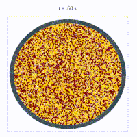
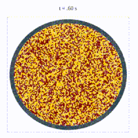
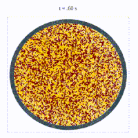

# Crowd dynamics simulations

<pre><pre>

<pre><pre> 

## Code Description
The code is written in C programming language and simulates the behavior of a collection of self-propelled particles in a fluid medium. The code includes the calculation of forces between particles, fluid drag forces, and self-propelling forces. The simulation also includes the calculation of the moment for a chain of particles in a multi-sphere model.

## How to Use
Clone the repository to your local machine.
Compile the code using a C compiler such as gcc.
Run the compiled program using the command prompt or terminal.
Adjust the input parameters as necessary to customize the simulation.

## Input Parameters
The following input parameters can be adjusted in the code:

- nfcsq: Number of cells in the grid.
- npp: Number of particles per cell.
- rho: Density of the fluid.
- V_surr: Volume of the surrounding fluid.
- sigma: Volume of a single particle.
- mass: Mass of each particle.
- ga: Acceleration due to gravity.
- dm: Diameter of each particle.
- k_stiff: Stiffness coefficient of each particle.
- cv: Viscous damping coefficient.
- beta: Magnitude of self-propelling force.
- gamma: Motive parameter for self-propelling force.
- video_time: Time duration of the simulation.
- limit_overlap: Overlap limit between particles.
- limit: Limit for pairwise random forces.
- cf: Coupling factor.
- cj: Frequency of cell updates.
- cellfrq: Frequency of binning particles.
- dm_avg: Average diameter of particles.
- multisphere_model: Flag for enabling the multi-sphere model.
- core: Number of particles in the core of the multi-sphere model.
- mominertia: Moment of inertia of the multi-sphere model.
 
## Output
The simulation outputs the behavior of the collection of particles over time. This can be visualized using an appropriate software tool, such as MATLAB or Python. The output includes the positions, velocities, and accelerations of the particles at each time step. Additionally, the output includes the moments for the chain of particles in the multi-sphere model.
